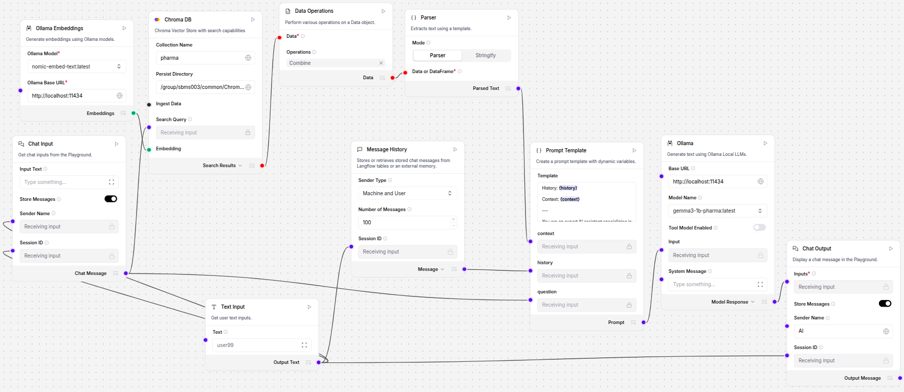
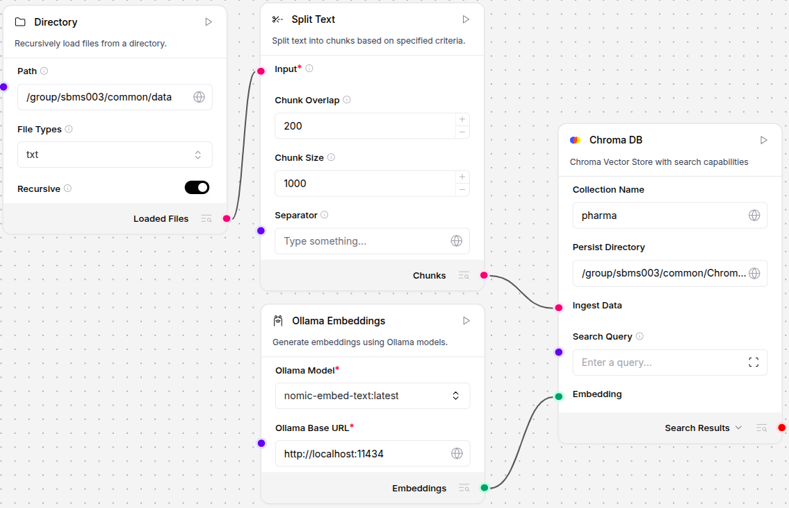

# LangFlow with RAG

----

Langflow is a powerful tool for building and deploying AI-powered agents and workflows. It provides developers with both a visual authoring experience and built-in API and MCP servers that turn every workflow into a tool that can be integrated into applications built on any framework or stack. Langflow supports all major LLMs, vector databases and a growing library of AI tools.

## 1. Installation and Execution

When installing LangFlow, dependency conflicts may occur between Python packages. Therefore, it is recommended to install LangFlow in a separate Python environment. On the Kaya server, the following steps were used for installation and execution:

```bash
$ tmux new-session -t langflow    # keep running in the background
$ conda create -y -p /group/sbms003/your-id/conda-envs/langflow python=3.13
$ conda activate langflow                           
$ pip install uv
$ uv run langflow run
```

LangFlow runs by default on local TCP port 7860 and provides an HTTP interface. While remote access is technically possible, external connections are blocked by the Kaya firewall, so users must access LangFlow via SSH tunneling.

```txt
From the user’s local terminal:
ssh -N -f -L 7860:localhost:7860 your_id@kaya01.hpc.uwa.edu.au

Then, open the browser on the local computer and visit:
http://localhost:7860
```

## 2. Workflow

The final output of the project runs on a LangFlow Workflow, which orchestrates the components, data connections, and flow of input/output among modules. For example, a workflow can be composed of interconnected components such as Document Loader, Text Splitter, Embeddings, Vector Store, Retriever, Prompt Template, and LLM, defining a complete reasoning or retrieval pipeline.

The configured workflows are divided into two main flows:

* **Data Ingestion Flow**: Builds the vector database for RAG by loading and embedding documents.
* **Inference Flow**: Takes the user’s input, retrieves relevant context from the vector store, incorporates conversation history, and sends the combined information to the fine-tuned model deployed on Ollama to generate responses.



The Prompt Template component is configured as follows:

```yaml
History: {history}

Context: {context}

---

You are an expert AI assistant specializing in Pharmaceutical Formulation Development. 
Your role is to provide accurate, evidence-based, and precise information regarding drug formulation, excipient compatibility, process optimization, and regulatory considerations. 
Always prioritize factual accuracy and technical details over creativity.
Do not answer with duplicate ingredients.

Given the history and context above, answer the question as best as possible.

Question: {question}

Answer: 
```

## 3. RAG (Retrieval-Augmented Generation)

Retrieval-Augmented Generation (RAG) enhances a language model’s ability to provide accurate and contextually relevant responses. Instead of relying solely on the model’s internal knowledge, RAG retrieves relevant documents or text chunks from an external vector database based on the user’s query. These retrieved texts are then appended to the model’s prompt as contextual information before generation. This approach allows the model to:

* Access up-to-date or domain-specific knowledge that was not part of its original training data.
* Improve factual accuracy and reduce hallucination.
* Provide source-grounded, explainable responses.

In this project, RAG is mainly used to reduce hallucination, because using incorrect information in pharmaceutical contexts can have significant consequences, potentially leading to misinformation about drug composition, dosage, or safety. Therefore, incorporating RAG ensures that the model grounds its responses in verified medical and pharmaceutical data sources, such as DailyMed, enhancing factual accuracy and reliability in generated outputs.

### 3.1. Creating a Vector DB

Among the vector DB options for RAG, file-based vector DBs are simpler and more portable to install and set up. In this project, we create a Chroma DB as the vector store for document embeddings with the data ingestion flow using LangFlow.

The dataset used for instruction-response fine-tuning was divided into training, validation, and test sets. While only the training set was used for model fine-tuning, all three sets were included when constructing the vector database. This ensures that the retrieval system has access to a wider range of domain-relevant text during inference, allowing the fine-tuned model to refer to diverse knowledge sources without retraining.

We used the nomic-embed-text embedding model for ingesting the data, and the same embedding model should be used when retrieving relevant context from the vector DB during the inference flow.



### 3.2. Updating a Vector DB
Updating the vector DB is straightforward. When new data (additional DailyMed files, updated guidelines) becomes available, the workflow can be rerun with the same ingestion pipeline:

* Add new source files to the directory path specified in the Directory Component
* Re-run the data ingestion flow using the ▷ button in the Chroma DB component

The pipeline automatically loads and embeds any new or modified files. The Chroma DB is incrementally updated, so existing embeddings are preserved, and new entries are appended.

Regularly updating the vector store allows the RAG system to stay synchronized with the latest domain knowledge, ensuring that responses generated by the fine-tuned model remain relevant and accurate over time.
